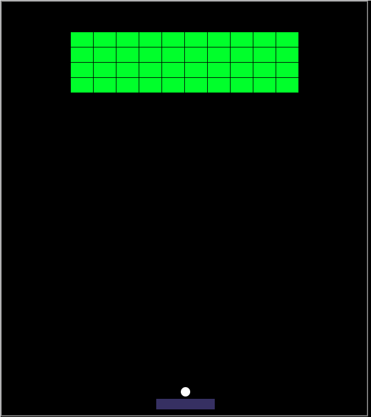

# Arkanoid Game

Arkanoid est un jeu d'arcade classique. Le gameplay implique de contrôler une raquette en bas de l'écran pour faire rebondir une balle de haut en bas, le but étant de détruire un mur de briques en haut de l'écran.

Le joueur déplace la raquette horizontalement pour maintenir la balle en jeu et l'empêcher de tomber en bas de l'écran. Lorsque la balle touche une brique, la brique est détruite et le joueur gagne des points.

## Instructions

1. **Lancement du Jeu :**
    - Assurez-vous d'avoir un navigateur web.
    - Ouvrez le fichier `index.html` dans votre navigateur préféré.

2. **Commandes :**
      - Utilisez les touches fléchées gauche et droite pour déplacer la raquette.
    - Appuyez sur la barre d'espace pour lancer la balle.
    - Pour mettre en pause le jeu, utilisez la touche "Pause". Appuyez à nouveau pour reprendre.
    - Pour réinitialiser le jeu, appuyez sur la touche "Échap".
    
3. **Objectif du Jeu :**
    - Détruisez toutes les briques en rebondissant la balle avec la raquette.

4. **Passer au Niveau Suivant :**
    - Si le joueur réussit à détruire toutes les briques, il passe au niveau suivant.
    - Au total, il y a 5 niveaux à compléter.

5. **Fin de la Partie :**
    - La partie se termine lorsque toutes les vies sont épuisées ou tous les niveaux sont terminés.
    - Le jeu enregistre les meilleurs scores.

