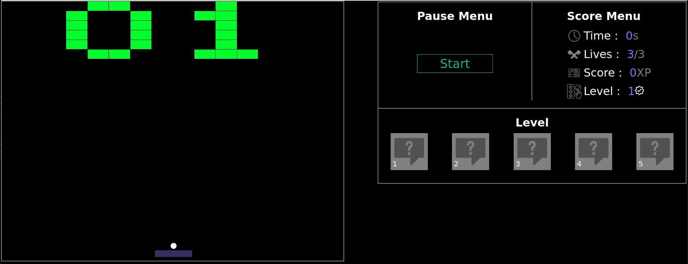

# Arkanoid Game

Arkanoid est un jeu d'arcade classique. Le gameplay implique de contrôler une raquette en bas de l'écran pour faire rebondir une balle de haut en bas, le but étant de détruire un mur de briques en haut de l'écran.

Le joueur déplace la raquette horizontalement pour maintenir la balle en jeu et l'empêcher de tomber en bas de l'écran. Lorsque la balle touche une brique, la brique est détruite et le joueur gagne des points.


## Instructions

1. **Cloner le projet  :**
 ```
  git clone https://learn.zone01dakar.sn/git/ssambadi/make-your-game
```
    
2. **Accédez au répertoire du projet  :**
```
  cd make-your-game
```

3. **Lancement du Jeu :**
   
   vous avez deux options:
 - Ouvrir le fichier index.html :

    - Localisez le fichier index.html dans le dossier du jeu.
    - Cliquez avec le bouton droit sur le fichier et ouvrez-le avec votre      navigateur web préféré.
- Utiliser l'extension Live Server :

    - Si vous préférez une solution plus dynamique, vous pouvez télécharger et installer l'extension Live Server pour votre navigateur.
    - Après l'installation, cliquez avec le clic droit sur le fichier index.html et sélectionnez "Open with Live Server" pour démarrer le jeu ou "go live en bas".

4. **Commandes :**
      - Utilisez les touches fléchées gauche et droite pour déplacer la raquette.
    - Appuyez sur la barre d'espace pour lancer la balle.
    - Pour mettre en pause le jeu, utilisez la touche "Pause". Appuyez à nouveau pour reprendre.
    - Pour réinitialiser le jeu, appuyez sur la touche "Échap".

    - En outre, vous avez également la possibilité d'utiliser le menu directement comme alternative.
    
5. **Objectif du Jeu :**
    - Détruisez toutes les briques en rebondissant la balle avec la raquette.

6. **Passer au Niveau Suivant :**
    - Si le joueur réussit à détruire toutes les briques, il passe au niveau suivant.
    - Au total, il y a 5 niveaux à compléter.
    

7. **Fin de la Partie :**
    - La partie se termine lorsque toutes les vies sont épuisées ou tous les niveaux sont terminés.
    
8.  **Informations de Jeu :**
    - Le jeu affiche en temps réel le Score, le Temps et le Nombre de Vies restantes.
    - Chaque partie commence avec 3 vies. Si toutes les vies sont épuisées, le jeu est réinitialisé au niveau actuel.
    - Une fois qu'un niveau est terminé, vous aurez la possibilité d'accéder à l'historique, où vous pourrez consulter le temps écoulé, le nombre de vies restantes et votre score.


#### Screenshot level 1


#### Screenshot level 2


#### Screenshot level 3


#### Screenshot level 4


#### Screenshot level 5




## Authors

- [@ssambadi](https://learn.zone01dakar.sn/git/ssambadi)

- [@alogou](https://learn.zone01dakar.sn/git/alogou)

- [@alo](https://learn.zone01dakar.sn/git/alo)